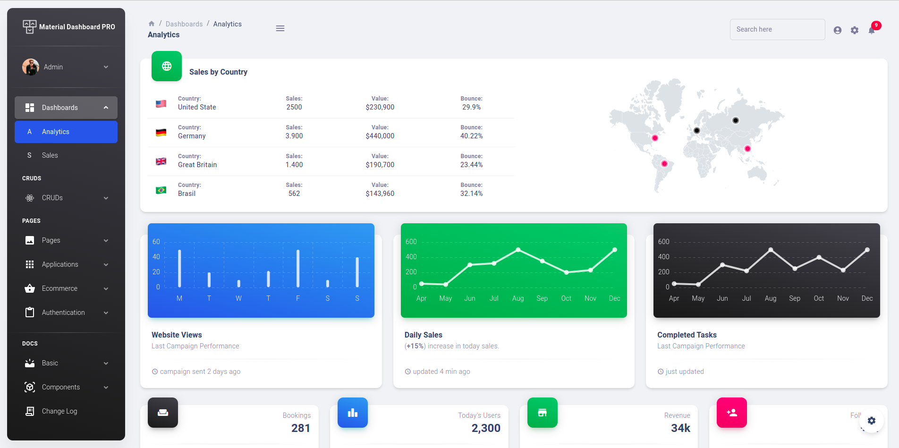

# [Material Dashboard 2 PRO React NodeJS API](https://material-dashboard-pro-react-nodejs.creative-tim.com/dashboards/analytics?ref=readme-mdpr) [](https://twitter.com/intent/tweet?text=Check%20Material%20Dashboard%20%20PRO%20React%20made%20by%20%40CreativeTim%20and%20%40UPDIVISION%20%23webdesign%20%23dashboard%20%23react%20%23mui&url=https%3A%2F%2Fwww.creative-tim.com%2Fproduct%2Fmaterial-dashboard-pro-react-nodejs)

 [](https://github.com/creativetimofficial/ct-material-dashboard-pro-react-nodejs/issues?q=is%3Aopen+is%3Aissue) [](https://github.com/creativetimofficial/ct-material-dashboard-pro-react-nodejs/issues?q=is%3Aissue+is%3Aclosed)

[](https://www.creative-tim.com/product/material-dashboard-pro-react-nodejs?ref=readme-mdpr)

**Documentation built by Developers**

Each element is well presented in very complex documentation.

You can read more about the [documentation here](https://material-dashboard-react-node-docs.creative-tim.com/react/overview/material-dashboard-node/).

**Example Pages**

If you want to get inspiration or just show something directly to your clients, you can jump-start your development with our pre-built example pages. You will be able to quickly set up the basic structure for your web project.

View [example pages here](https://material-dashboard-pro-react-nodejs.creative-tim.com/auth/login).

**HELPFUL LINKS**

- View [Github Repository](https://github.com/creativetimofficial/ct-material-dashboard-pro-react-nodejs)
- Check [FAQ Page](https://www.creative-tim.com/faq)

#### Special thanks

During the development of this dashboard, we have used many existing resources from awesome developers. We want to thank them for providing their tools open source:

- [MUI](https://mui.com/) - The React UI library for faster and easier web development.
- [React Table](https://react-table.tanstack.com/) - Lightweight and extensible data tables for React.
- [React Flatpickr](https://github.com/haoxins/react-flatpickr) - Useful library used to select date.
- [React ChartJS 2](http://reactchartjs.github.io/react-chartjs-2/#/) - Simple yet flexible React charting for designers & developers.
- [Full Calendar](https://fullcalendar.io/) - Full-sized drag & drop event calendar.
- [Dropzone](https://www.dropzonejs.com/) - An open source library that provides drag & drop file uploads with image previews.
- [React Kanban](https://github.com/asseinfo/react-kanban) - Kanban/Trello board lib for React.
- [React Images Viewer](https://guonanci.github.io/react-images-viewer/) - A simple, responsive images viewer component for ReactJS.
- [React Quill](https://github.com/zenoamaro/react-quill) - A free, open source WYSIWYG editor built for the modern web.
- [Formik](https://formik.org/) - Formik is the world's most popular open source form library for React and React Native.
- [ChromaJS](https://gka.github.io/chroma.js/) - A small-ish zero-dependency JavaScript library for all kinds of color conversions and color scales.
- [UUID](https://github.com/uuidjs/uuid) - JavaScript library for generating random id numbers.
- [HTML React Parser](https://github.com/remarkablemark/html-react-parser) - A utility for converting HTML strings into React components.
- [CASL](https://casl.js.org/v5/en/guide/intro) - An isomorphic authorization JavaScript library which restricts what resources a given client is allowed to access

Let us know your thoughts below. And good luck with development!

## Table of Contents

- [Versions](#versions)
- [Demo](#demo)
- [Quick Start](#quick-start)
- [Documentation](#documentation)
- [Login](#login)
- [Register](#register)
- [Forgot Password](#forgot-password)
- [Reset Password](#reset-password)
- [User Profile](#user-profile)
- [User Management](#user-management)
- [Role Management](#role-management)
- [Category Management](#category-management)
- [Tag Management](#tag-management)
- [File Structure](#file-structure)
- [Browser Support](#browser-support)
- [Resources](#resources)
- [Reporting Issues](#reporting-issues)
- [Technical Support or Questions](#technical-support-or-questions)
- [Licensing](#licensing)
- [Useful Links](#useful-links)

## Version

[](https://www.creative-tim.com/product/material-dashboard-pro-react?ref=readme-mdpr)
[](https://www.creative-tim.com/product/material-dashboard-2-pro-react-ts?ref=readme-mdpr)
[](https://www.creative-tim.com/product/react-material-dashboard-pro-laravel?ref=readme-mdpr)
[](https://www.creative-tim.com/product/material-dashboard-pro-react-nodejs?ref=readme-mdpr)

| React                                                                                                                                                                                                                                  | Typescript                                                                                                                                                                                                                                                 |
| -------------------------------------------------------------------------------------------------------------------------------------------------------------------------------------------------------------------------------------- | ---------------------------------------------------------------------------------------------------------------------------------------------------------------------------------------------------------------------------------------------------------- |
| [](http://demos.creative-tim.com/material-dashboard-pro-react/#/dashboards/analytics?ref=readme-mdpr) | [](http://demos.creative-tim.com/material-dashboard-2-pro-react-ts/#/dashboards/analytics?ref=readme-mdpr) |

| React + Laravel JSON:API                                                                                                                                                                                                                                                   | React + NodeJS                                                                                                                                                                                                                                                               |
| ------------------------------------------------------------------------------------------------------------------------------------------------------------------------------------------------------------------------------------------------------------------ | -------------------------------------------------------------------------------------------------------------------------------------------------------------------------------------------------------------------------------------------------------------------- |
| [](https://react-material-dashboard-pro-laravel.creative-tim.com/auth/login?ref=readme-mdpr) | [](https://material-dashboard-pro-react-nodejs.creative-tim.com/dashboards/analytics?ref=readme-mdpr) |

## Demo

| Register                                                                                                                                            | Login                                                                                                                                         |
| --------------------------------------------------------------------------------------------------------------------------------------------------- | --------------------------------------------------------------------------------------------------------------------------------------------- |
| [](https://material-dashboard-pro-react-nodejs.creative-tim.com/auth/register) | [](https://material-dashboard-pro-react-nodejs.creative-tim.com/auth/login) |

| Forgot Password Page                                                                                                                                              | Reset Password Page                                                                                                                         |
| ----------------------------------------------------------------------------------------------------------------------------------------------------------------- | ------------------------------------------------------------------------------------------------------------------------------------------- |
| [](https://material-dashboard-pro-react-nodejs.creative-tim.com/auth/forgot-password) | [](https://material-dashboard-pro-react-nodejs.creative-tim.com) |

| Dashboard                                                                                                                                                   | RTL                                                                                                                                       |
| ----------------------------------------------------------------------------------------------------------------------------------------------------------- | ----------------------------------------------------------------------------------------------------------------------------------------- |
| [](https://material-dashboard-pro-react-nodejs.creative-tim.com/dashboards/analytics) | [](https://material-dashboard-pro-react-nodejs.creative-tim.com/pages/rtl) |

| Profile Page                                                                                                                                           | User Management                                                                                                                                                    |
| ------------------------------------------------------------------------------------------------------------------------------------------------------ | ------------------------------------------------------------------------------------------------------------------------------------------------------------------ |
| [](https://material-dashboard-pro-react-nodejs.creative-tim.com/examples-api/user-profile) | [](https://material-dashboard-pro-react-nodejs.creative-tim.com/examples-api/user-management) |

| Role Management                                                                                                                                                   | Item Management                                                                                                                                                   |
| ----------------------------------------------------------------------------------------------------------------------------------------------------------------- | ----------------------------------------------------------------------------------------------------------------------------------------------------------------- |
| [](https://material-dashboard-pro-react-nodejs.creative-tim.com/examples-api/role-management) | [](https://material-dashboard-pro-react-nodejs.creative-tim.com/examples-api/item-management) |

| Category Management                                                                                                                                                       | Tag Management                                                                                                                                                  |
| ------------------------------------------------------------------------------------------------------------------------------------------------------------------------- | --------------------------------------------------------------------------------------------------------------------------------------------------------------- |
| [](https://material-dashboard-pro-react-nodejs.creative-tim.com/examples-api/category-management) | [](https://material-dashboard-pro-react-nodejs.creative-tim.com/examples-api/tag-management) |

[View More](https://material-dashboard-pro-react-nodejs.creative-tim.com/dashboards/analytics).

## Quick start

## Prerequisites

For your local development you need to have `Node.js` and `npm` version 16 or above installed and a registered MongoDB collection:
- For Windows: https://phoenixnap.com/kb/install-node-js-npm-on-windows
- For Linux: https://www.geeksforgeeks.org/installation-of-node-js-on-linux/
- For Mac: https://treehouse.github.io/installation-guides/mac/node-mac.html

## ExpressJS API Backend Installation

To install the project you need to have version 16 of Node.js and npm version 8. The first step is to run `npm install` command. Next you need to copy the `.env.example` file and name it `.env`. There are the variables for the database and the URLs:
- DB_USER=the-mongo-user-name
- DB_PASSWORD=mongo-password
- DB_NAME=name-of-the-db

- JWT_SECRET="token"

- APP_URL_CLIENT= with the default value of http://localhost:3000
- APP_URL_API= with the default value of http://localhost:8080

## Material React Frontend Installation

1. Set up your api for the project
2. Download and Install NodeJs LTS version from [NodeJs Official Page](https://nodejs.org/en/download/).
3. Navigate to the root ./ directory of the product and run `yarn install` or `npm install` to install our local dependencies.
4. Change the .env.example in .env and add the necessary variables values.
   - `REACT_APP_URL=your-project-url`
   - `REACT_APP_API_URL=the-path-of-the-api`, for example `https://node-json-api-pro.creative-tim.com/` from our [Headless CSM with Exress.js](https://headless-cms-with-expressjs-api-pro.creative-tim.com/)
   - `REACT_APP_IS_DEMO=false` or `true` if you want to add some restrictions
   - `REACT_APP_IMAGES=the-path-for-the-image` in case of local API
5. In `package.json` in the `proxy` variable add the right path to your API
6. Run `yarn start` or `npm start`

## Documentation

The documentation for the Material Dashboard is hosted at our [website](https://material-dashboard-react-node-docs.creative-tim.com/react/overview/material-dashboard-node/?ref=readme-mdpr).

The documentation for the ExpressJS API is hosted [here](https://documenter.getpostman.com/view/8138626/Uze1virp).

## Login

If a user is not logged in can access only the authentication pages: Login, Register and Forgot Password. By default, there are 3 different credentials that can be used for logging in:

- **admin@jsonapi.com** with password **secret**
- **creator@jsonapi.com** with password **secret**
- **member@jsonapi.com** with password **secret**

These credentials are for users with different roles so they have different access and rights.

Authentication context and protected routes were used to keep track of the state of the users and their permissions. Axios together with an HTTP service and helped by an auth service and crud service handled the requests. The **/src/service** keeps the logic of the services while **/src/context** has the logic for the different contexts used, including the authentication context.

In the **/src/auth/login/index.js** is the logic for logging in an existing user:

```
    try {
      const response = await AuthService.login(myData);
      authContext.login(response.access_token, response.refresh_token);
    } catch (res) {
      if (res.hasOwnProperty("message")) {
        setErrors({ ...errors, credentialsErros: true, textError: res.message });
      } else {
        setErrors({ ...errors, credentialsErros: true, textError: res.errors[0].detail });
      }
    }
```

## Register

It can be added a new user by registration. The user has a name, email, password and the confirmation of the password that needs to be added. All the inputs are verified and validated. You can simply access the page with the **Sign up** button or adding **/register** in the url. The new user will get the role of an admin by default and it can be changed in the user-management if you want to restrict its permissions.

In the **/src/auth/register/index.js** is the logic for signing up a new user:

```
    const response = await AuthService.register(myData);

    authContext.login(response.access_token, response.refresh_token);
```

## Forgot Password

In case of forgetting its password, the user can go to a page where he adds the email of the account and an email will be send to that address to help with resetting the password. It can be accessed from the Login page by clicking the **here** button or by adding **/forgot-password**.

In the **/src/auth/forgot-password/index.js** is the logic for requesting a password reset:

```
    const myData = {
      data: {
        type: "password-forgot",
        attributes: {
          redirect_url: `${process.env.REACT_APP_URL}/auth/reset-password`,
          ...input,
        },
      },
    };

    try {
      const res = await authService.forgotPassword(myData);
    } catch (err) {
      console.error(err);
      return null;
    }
```

## Reset Password

For resetting the password, the user must acceess the url sent int the email. By adding the new password and the confirmation and then pressing the **channge** button the data of the account is updated. You can go back to login from the button in notification.

In the **/src/auth/reset-password/index.js** is the logic for resetting the password:

```
  useEffect(() => {
    // get the token and email sent in the url
    const queryParams = new URLSearchParams(window.location.search);
    setToken(queryParams.get("token"));
    setEmail(queryParams.get("email"));
  }, []);
```

## User Profile

From the sidenav, in the CRUDs section, or by adding **/examples-api/user-profile** in the url, the User Profile is a dynamic page where the user can add details about him: profile image, name, email or change password. Validation is added for every input.

In the **/src/services/auth-serivce** you can find the routes sets for the request and in the **/src/cruds/user-profile** is the component for the editing the profile details.

```
  getProfile = async () => {
    const getProfile = "me";
    return await HttpService.get(getProfile);
  };

  updateProfile = async (newInfo) => {
    const updateProfile = "me";
    return await HttpService.patch(updateProfile, newInfo);
  };
```

## User Management

In the User Management section only the user with **admin** role has permission to it. The admin can view, add, edit or delete other users. The **+ Add User** button leads to the page for creating a new user where the details about the user are added and a role is assgined. In the **Actions** column of the table are the possibilites of updating or deleting the user.

In the **/src/cruds/user-management** you can find the component:

```
  const getRows = (info) => {
    let updatedInfo = info.map((row) => {
      let roleId = row.relationships.roles.data[0].id;
      let roleName = roles.find((role) => role.id == roleId);
      return {
        type: "users",
        id: row.id,
        image: row.attributes.profile_image,
        name: row.attributes.name,
        email: row.attributes.email,
        role: roleName.attributes.name,
        created_at: row.attributes.created_at,
      };
    });
    return updatedInfo;
  };
```

## Role Management

The Role Management section is another section for the **admin**. Here the admin can view, add, edit or delete roles. The **+ Add role** button gets the user to the page for creating a new role, while the **Actions** column had the delete and edit buttons. A role that is assigned to a user can't be deleted.
It is important to know the permissions of the 3 default roles of the application:

- the **admin** has all permissions (can view, add, edit or delete anything)
- the **creator** has limited access to category, tags and items section where he can also add, edit or delete
- the **member** has only permissions to view categories, tags and items and no other action on them

For managing the permissions CASL pacakge was used.

In the **/src/App.js** the permissions are taken and the abilities of the user are set according to the role:

```
  useEffect(() => {
    if (!authContext.isAuthenticated) return;
    (async () => {
      const id = await authContext.getCurrentUser();
      const rules = await getPermissions(id);
      ability.update(rules);
    })();
  }, [authContext.isAuthenticated]);
```

## Category Management

The category section can be viewed by all users with any od the 3 default roles, but only the admin and creator can add, edit or delete. A category can be added with the **+ Add category** button and other updates in the **Actions** column of the table.

For showing or not the buttons for delete or edit in category section CASL helpe. In **/src/cruds/category-management**:

```
    {ability.can("delete", "categories") && (
    <Tooltip title="Delete Category">
        <IconButton onClick={(e) => clickDeleteHandler(e, info.cell.row.original.id)}>
        <DeleteIcon />
        </IconButton>
    </Tooltip>
    )}
```

## Tag management

Tag Management is also availbale for all the users of the 3 types, but the member can not add, edit or delete a tag. The **+Add tag** button and the **Actions** buttons help with the actions.

In the **/src/cruds/tag-management/new-tag** is the logic for creating a tag:

```
    try {
      await CrudService.createTag(tag);
      navigate("/examples-api/tag-management", {
        state: { value: true, text: "The tag was sucesfully created" },
      });
    } catch (err) {
      if (err.hasOwnProperty("errors")) {
        setName({ ...name, error: true, textError: err.errors[0].detail });
      }
      console.error(err);
    }
```

## Item Management

The Item Management section is a more complex CRUD because an item has associated a category and one or mare tags. The member has the permission to only view it, while the admin and creator can add an item with the **+ Add item** button and delete or edit an item with the buttons from the **Actions** section.

In the **/src/cruds/item-management** is the component for viewing the items:

```
    const response = await CrudService.getItems();
    const myData = response.data;

    const categories = await Promise.all(myData.map((item) => getCategory(item)));
    const tags = await Promise.all(myData.map((item) => getTags(item)));

    const toSetTags = [];
    for (let i = 0; i < tags.length; i++) {
    const element = tags[i].data.map((tag) => {
        return {
        key: `${i}-${tag.id}`,
        name: tag.attributes.name,
        color: tag.attributes.color,
        };
    });
    toSetTags.push(element);
    }
```

### What's included

Within the download you'll find the following directories and files:

```
./src
├── App.js
├── assets
│   ├── images
│   │   ├── apple-icon.png
│   │   ├── bg-player.jpeg
│   │   ├── bg-pricing.jpg
│   │   ├── bg-profile.jpeg
│   │   ├── bg-reset-cover.jpeg
│   │   ├── bg-sign-in-basic.jpeg
│   │   ├── bg-sign-in-cover.jpeg
│   │   ├── bg-sign-up-cover.jpeg
│   │   ├── bg-smart-home-1.jpg
│   │   ├── bg-smart-home-2.jpg
│   │   ├── bruce-mars.jpg
│   │   ├── down-arrow-dark.svg
│   │   ├── down-arrow.svg
│   │   ├── down-arrow-white.svg
│   │   ├── drake.jpg
│   │   ├── ecommerce
│   │   │   ├── adidas-hoodie.jpeg
│   │   │   ├── alchimia-chair.jpeg
│   │   │   ├── bang-sound.jpeg
│   │   │   ├── black-chair.jpeg
│   │   │   ├── black-mug.jpeg
│   │   │   ├── blue-shoe.jpeg
│   │   │   ├── burberry.jpeg
│   │   │   ├── chair-pink.jpeg
│   │   │   ├── chair-steel.jpeg
│   │   │   ├── chair-wood.jpeg
│   │   │   ├── d&g-skirt.jpeg
│   │   │   ├── fendi-coat.jpeg
│   │   │   ├── gold-glasses.jpeg
│   │   │   ├── green-sofa.jpeg
│   │   │   ├── heron-tshirt.jpeg
│   │   │   ├── living-chair.jpeg
│   │   │   ├── macbook-pro.jpeg
│   │   │   ├── mcqueen-shirt.jpeg
│   │   │   ├── metro-chair.jpeg
│   │   │   ├── off-white-jacket.jpeg
│   │   │   ├── orange-sofa.jpeg
│   │   │   ├── photo-tools.jpeg
│   │   │   ├── undercover.jpeg
│   │   │   ├── wooden-table.jpeg
│   │   │   ├── yellow-chair.jpeg
│   │   │   └── yohji-yamamoto.jpeg
│   │   ├── favicon.png
│   │   ├── home-decor-1.jpg
│   │   ├── home-decor-2.jpg
│   │   ├── home-decor-3.jpg
│   │   ├── home-decor-4.jpeg
│   │   ├── icons
│   │   │   └── flags
│   │   │       ├── AU.png
│   │   │       ├── BR.png
│   │   │       ├── DE.png
│   │   │       ├── GB.png
│   │   │       └── US.png
│   │   ├── illustrations
│   │   │   ├── illustration-lock.jpg
│   │   │   ├── illustration-reset.jpg
│   │   │   ├── illustration-verification.jpg
│   │   │   └── pattern-tree.svg
│   │   ├── ivana-square.jpg
│   │   ├── ivana-squares.jpg
│   │   ├── ivancik.jpg
│   │   ├── kal-visuals-square.jpg
│   │   ├── logo-ct-dark.png
│   │   ├── logo-ct.png
│   │   ├── logos
│   │   │   ├── gray-logos
│   │   │   │   ├── logo-coinbase.svg
│   │   │   │   ├── logo-nasa.svg
│   │   │   │   ├── logo-netflix.svg
│   │   │   │   ├── logo-pinterest.svg
│   │   │   │   ├── logo-spotify.svg
│   │   │   │   └── logo-vodafone.svg
│   │   │   ├── mastercard.png
│   │   │   └── visa.png
│   │   ├── marie.jpg
│   │   ├── meeting.jpg
│   │   ├── office-dark.jpg
│   │   ├── product-12.jpg
│   │   ├── products
│   │   │   ├── product-11.jpg
│   │   │   ├── product-1-min.jpg
│   │   │   ├── product-2-min.jpg
│   │   │   ├── product-3-min.jpg
│   │   │   ├── product-4-min.jpg
│   │   │   ├── product-5-min.jpg
│   │   │   ├── product-6-min.jpg
│   │   │   ├── product-7-min.jpg
│   │   │   ├── product-details-1.jpg
│   │   │   ├── product-details-2.jpg
│   │   │   ├── product-details-3.jpg
│   │   │   ├── product-details-4.jpg
│   │   │   └── product-details-5.jpg
│   │   ├── shapes
│   │   │   ├── pattern-lines.svg
│   │   │   └── waves-white.svg
│   │   ├── small-logos
│   │   │   ├── bootstrap.svg
│   │   │   ├── creative-tim.svg
│   │   │   ├── devto.svg
│   │   │   ├── github.svg
│   │   │   ├── google-webdev.svg
│   │   │   ├── icon-bulb.svg
│   │   │   ├── icon-sun-cloud.png
│   │   │   ├── logo-asana.svg
│   │   │   ├── logo-atlassian.svg
│   │   │   ├── logo-invision.svg
│   │   │   ├── logo-jira.svg
│   │   │   ├── logo-slack.svg
│   │   │   ├── logo-spotify.svg
│   │   │   └── logo-xd.svg
│   │   ├── team-1.jpg
│   │   ├── team-2.jpg
│   │   ├── team-3.jpg
│   │   ├── team-4.jpg
│   │   └── team-5.jpg
│   ├── theme
│   │   ├── base
│   │   │   ├── borders.js
│   │   │   ├── boxShadows.js
│   │   │   ├── breakpoints.js
│   │   │   ├── colors.js
│   │   │   ├── globals.js
│   │   │   └── typography.js
│   │   ├── components
│   │   │   ├── appBar.js
│   │   │   ├── avatar.js
│   │   │   ├── breadcrumbs.js
│   │   │   ├── button
│   │   │   │   ├── contained.js
│   │   │   │   ├── index.js
│   │   │   │   ├── outlined.js
│   │   │   │   ├── root.js
│   │   │   │   └── text.js
│   │   │   ├── buttonBase.js
│   │   │   ├── card
│   │   │   │   ├── cardContent.js
│   │   │   │   ├── cardMedia.js
│   │   │   │   └── index.js
│   │   │   ├── container.js
│   │   │   ├── dialog
│   │   │   │   ├── dialogActions.js
│   │   │   │   ├── dialogContent.js
│   │   │   │   ├── dialogContentText.js
│   │   │   │   ├── dialogTitle.js
│   │   │   │   └── index.js
│   │   │   ├── divider.js
│   │   │   ├── flatpickr.js
│   │   │   ├── form
│   │   │   │   ├── autocomplete.js
│   │   │   │   ├── checkbox.js
│   │   │   │   ├── formControlLabel.js
│   │   │   │   ├── formLabel.js
│   │   │   │   ├── input.js
│   │   │   │   ├── inputLabel.js
│   │   │   │   ├── inputOutlined.js
│   │   │   │   ├── radio.js
│   │   │   │   ├── select.js
│   │   │   │   ├── switchButton.js
│   │   │   │   └── textField.js
│   │   │   ├── iconButton.js
│   │   │   ├── icon.js
│   │   │   ├── linearProgress.js
│   │   │   ├── link.js
│   │   │   ├── list
│   │   │   │   ├── index.js
│   │   │   │   ├── listItem.js
│   │   │   │   └── listItemText.js
│   │   │   ├── menu
│   │   │   │   ├── index.js
│   │   │   │   └── menuItem.js
│   │   │   ├── popover.js
│   │   │   ├── sidenav.js
│   │   │   ├── slider.js
│   │   │   ├── stepper
│   │   │   │   ├── index.js
│   │   │   │   ├── stepConnector.js
│   │   │   │   ├── stepIcon.js
│   │   │   │   ├── step.js
│   │   │   │   └── stepLabel.js
│   │   │   ├── svgIcon.js
│   │   │   ├── table
│   │   │   │   ├── tableCell.js
│   │   │   │   ├── tableContainer.js
│   │   │   │   └── tableHead.js
│   │   │   ├── tabs
│   │   │   │   ├── index.js
│   │   │   │   └── tab.js
│   │   │   └── tooltip.js
│   │   ├── functions
│   │   │   ├── boxShadow.js
│   │   │   ├── gradientChartLine.js
│   │   │   ├── hexToRgb.js
│   │   │   ├── linearGradient.js
│   │   │   ├── pxToRem.js
│   │   │   └── rgba.js
│   │   ├── index.js
│   │   └── theme-rtl.js
│   └── theme-dark
│       ├── base
│       │   ├── borders.js
│       │   ├── boxShadows.js
│       │   ├── breakpoints.js
│       │   ├── colors.js
│       │   ├── globals.js
│       │   └── typography.js
│       ├── components
│       │   ├── appBar.js
│       │   ├── avatar.js
│       │   ├── breadcrumbs.js
│       │   ├── button
│       │   │   ├── contained.js
│       │   │   ├── index.js
│       │   │   ├── outlined.js
│       │   │   ├── root.js
│       │   │   └── text.js
│       │   ├── buttonBase.js
│       │   ├── card
│       │   │   ├── cardContent.js
│       │   │   ├── cardMedia.js
│       │   │   └── index.js
│       │   ├── container.js
│       │   ├── dialog
│       │   │   ├── dialogActions.js
│       │   │   ├── dialogContent.js
│       │   │   ├── dialogContentText.js
│       │   │   ├── dialogTitle.js
│       │   │   └── index.js
│       │   ├── divider.js
│       │   ├── flatpickr.js
│       │   ├── form
│       │   │   ├── autocomplete.js
│       │   │   ├── checkbox.js
│       │   │   ├── formControlLabel.js
│       │   │   ├── formLabel.js
│       │   │   ├── input.js
│       │   │   ├── inputLabel.js
│       │   │   ├── inputOutlined.js
│       │   │   ├── radio.js
│       │   │   ├── select.js
│       │   │   ├── switchButton.js
│       │   │   └── textField.js
│       │   ├── iconButton.js
│       │   ├── icon.js
│       │   ├── linearProgress.js
│       │   ├── link.js
│       │   ├── list
│       │   │   ├── index.js
│       │   │   ├── listItem.js
│       │   │   └── listItemText.js
│       │   ├── menu
│       │   │   ├── index.js
│       │   │   └── menuItem.js
│       │   ├── popover.js
│       │   ├── sidenav.js
│       │   ├── slider.js
│       │   ├── stepper
│       │   │   ├── index.js
│       │   │   ├── stepConnector.js
│       │   │   ├── stepIcon.js
│       │   │   ├── step.js
│       │   │   └── stepLabel.js
│       │   ├── svgIcon.js
│       │   ├── table
│       │   │   ├── tableCell.js
│       │   │   ├── tableContainer.js
│       │   │   └── tableHead.js
│       │   ├── tabs
│       │   │   ├── index.js
│       │   │   └── tab.js
│       │   └── tooltip.js
│       ├── functions
│       │   ├── boxShadow.js
│       │   ├── gradientChartLine.js
│       │   ├── hexToRgb.js
│       │   ├── linearGradient.js
│       │   ├── pxToRem.js
│       │   └── rgba.js
│       ├── index.js
│       └── theme-rtl.js
├── auth
│   ├── forgot-password
│   │   └── index.js
│   ├── login
│   │   └── index.js
│   ├── logout
│   │   └── index.js
│   ├── register
│   │   └── index.js
│   └── reset-password
│       └── index.js
├── Can.js
├── components
│   ├── MDAlert
│   │   ├── index.js
│   │   ├── MDAlertCloseIcon.js
│   │   └── MDAlertRoot.js
│   ├── MDAvatar
│   │   ├── index.js
│   │   └── MDAvatarRoot.js
│   ├── MDBadge
│   │   ├── index.js
│   │   └── MDBadgeRoot.js
│   ├── MDBadgeDot
│   │   └── index.js
│   ├── MDBox
│   │   ├── index.js
│   │   └── MDBoxRoot.js
│   ├── MDButton
│   │   ├── index.js
│   │   └── MDButtonRoot.js
│   ├── MDDatePicker
│   │   └── index.js
│   ├── MDDropzone
│   │   ├── index.js
│   │   └── MDDropzoneRoot.js
│   ├── MDEditor
│   │   ├── index.js
│   │   └── MDEditorRoot.js
│   ├── MDInput
│   │   ├── index.js
│   │   └── MDInputRoot.js
│   ├── MDPagination
│   │   ├── index.js
│   │   └── MDPaginationItemRoot.js
│   ├── MDProgress
│   │   ├── index.js
│   │   └── MDProgressRoot.js
│   ├── MDSnackbar
│   │   ├── index.js
│   │   └── MDSnackbarIconRoot.js
│   ├── MDSocialButton
│   │   ├── index.js
│   │   └── MDSocialButtonRoot.js
│   └── MDTypography
│       ├── index.js
│       └── MDTypographyRoot.js
├── config
│   └── Permissions
│       └── index.js
├── context
│   └── index.js
├── crud.routes.js
├── cruds
│   ├── category-management
│   │   ├── edit-category
│   │   │   └── index.js
│   │   ├── index.js
│   │   └── new-category
│   │       └── index.js
│   ├── item-management
│   │   ├── edit-item
│   │   │   └── index.js
│   │   ├── index.js
│   │   └── new-item
│   │       └── index.js
│   ├── role-managament
│   │   ├── edit-role
│   │   │   └── index.js
│   │   ├── index.js
│   │   └── new-role
│   │       └── index.js
│   ├── tag-management
│   │   ├── edit-tag
│   │   │   └── index.js
│   │   ├── index.js
│   │   └── new-tag
│   │       └── index.js
│   ├── user-management
│   │   ├── edit-user
│   │   │   └── index.js
│   │   ├── index.js
│   │   └── new-user
│   │       └── index.js
│   └── user-profile
│       ├── components
│       │   ├── BasicInfo
│       │   │   └── index.js
│       │   ├── ChangePassword
│       │   │   └── index.js
│       │   └── Header
│       │       └── index.js
│       └── index.js
├── examples
│   ├── Breadcrumbs
│   │   └── index.js
│   ├── Calendar
│   │   ├── CalendarRoot.js
│   │   └── index.js
│   ├── Cards
│   │   ├── BlogCards
│   │   │   └── SimpleBlogCard
│   │   │       └── index.js
│   │   ├── BookingCard
│   │   │   └── index.js
│   │   ├── ControllerCard
│   │   │   └── index.js
│   │   ├── InfoCards
│   │   │   ├── DefaultInfoCard
│   │   │   │   └── index.js
│   │   │   ├── MiniInfoCard
│   │   │   │   └── index.js
│   │   │   └── ProfileInfoCard
│   │   │       └── index.js
│   │   ├── MasterCard
│   │   │   └── index.js
│   │   ├── PricingCards
│   │   │   └── DefaultPricingCard
│   │   │       └── index.js
│   │   ├── ProjectCards
│   │   │   ├── ComplexProjectCard
│   │   │   │   └── index.js
│   │   │   └── DefaultProjectCard
│   │   │       └── index.js
│   │   └── StatisticsCards
│   │       ├── ComplexStatisticsCard
│   │       │   └── index.js
│   │       ├── DefaultStatisticsCard
│   │       │   └── index.js
│   │       └── MiniStatisticsCard
│   │           └── index.js
│   ├── Charts
│   │   ├── BarCharts
│   │   │   ├── HorizontalBarChart
│   │   │   │   ├── configs
│   │   │   │   │   └── index.js
│   │   │   │   └── index.js
│   │   │   ├── ReportsBarChart
│   │   │   │   ├── configs
│   │   │   │   │   └── index.js
│   │   │   │   └── index.js
│   │   │   └── VerticalBarChart
│   │   │       ├── configs
│   │   │       │   └── index.js
│   │   │       └── index.js
│   │   ├── BubbleChart
│   │   │   ├── configs
│   │   │   │   └── index.js
│   │   │   └── index.js
│   │   ├── DoughnutCharts
│   │   │   └── DefaultDoughnutChart
│   │   │       ├── configs
│   │   │       │   └── index.js
│   │   │       └── index.js
│   │   ├── LineCharts
│   │   │   ├── DefaultLineChart
│   │   │   │   ├── configs
│   │   │   │   │   └── index.js
│   │   │   │   └── index.js
│   │   │   ├── GradientLineChart
│   │   │   │   ├── configs
│   │   │   │   │   └── index.js
│   │   │   │   └── index.js
│   │   │   ├── ProgressLineChart
│   │   │   │   ├── config
│   │   │   │   │   └── index.js
│   │   │   │   └── index.js
│   │   │   └── ReportsLineChart
│   │   │       ├── configs
│   │   │       │   └── index.js
│   │   │       └── index.js
│   │   ├── MixedChart
│   │   │   ├── configs
│   │   │   │   └── index.js
│   │   │   └── index.js
│   │   ├── PieChart
│   │   │   ├── configs
│   │   │   │   └── index.js
│   │   │   └── index.js
│   │   ├── PolarChart
│   │   │   ├── configs
│   │   │   │   └── index.js
│   │   │   └── index.js
│   │   └── RadarChart
│   │       ├── configs
│   │       │   └── index.js
│   │       └── index.js
│   ├── Configurator
│   │   ├── ConfiguratorRoot.js
│   │   └── index.js
│   ├── Footer
│   │   └── index.js
│   ├── Items
│   │   ├── DefaultItem
│   │   │   ├── index.js
│   │   │   └── styles.js
│   │   └── NotificationItem
│   │       ├── index.js
│   │       └── styles.js
│   ├── LayoutContainers
│   │   ├── DashboardLayout
│   │   │   └── index.js
│   │   └── PageLayout
│   │       └── index.js
│   ├── Lists
│   │   ├── CategoriesList
│   │   │   └── index.js
│   │   └── ProfilesList
│   │       └── index.js
│   ├── Navbars
│   │   ├── DashboardNavbar
│   │   │   ├── index.js
│   │   │   └── styles.js
│   │   └── DefaultNavbar
│   │       ├── DefaultNavbarDropdown.js
│   │       ├── DefaultNavbarLink.js
│   │       ├── DefaultNavbarMobile.js
│   │       └── index.js
│   ├── ProtectedRoute
│   │   └── index.js
│   ├── Sidenav
│   │   ├── index.js
│   │   ├── SidenavCollapse.js
│   │   ├── SidenavItem.js
│   │   ├── SidenavList.js
│   │   ├── SidenavRoot.js
│   │   └── styles
│   │       ├── sidenavCollapse.js
│   │       ├── sidenavItem.js
│   │       └── sidenav.js
│   ├── Tables
│   │   ├── DataTable
│   │   │   ├── DataTableBodyCell.js
│   │   │   ├── DataTableHeadCell.js
│   │   │   └── index.js
│   │   └── SalesTable
│   │       ├── index.js
│   │       └── SalesTableCell.js
│   └── Timeline
│       ├── context
│       │   └── index.js
│       ├── TimelineItem
│       │   ├── index.js
│       │   └── styles.js
│       └── TimelineList
│           └── index.js
├── index.js
├── layouts
│   ├── applications
│   │   ├── calendar
│   │   │   ├── components
│   │   │   │   ├── Header
│   │   │   │   │   └── index.js
│   │   │   │   ├── NextEvents
│   │   │   │   │   └── index.js
│   │   │   │   └── ProductivityChart
│   │   │   │       ├── configs
│   │   │   │       │   └── index.js
│   │   │   │       └── index.js
│   │   │   ├── data
│   │   │   │   └── calendarEventsData.js
│   │   │   └── index.js
│   │   ├── data-tables
│   │   │   ├── data
│   │   │   │   └── dataTableData.js
│   │   │   └── index.js
│   │   ├── kanban
│   │   │   ├── components
│   │   │   │   ├── Card
│   │   │   │   │   └── index.js
│   │   │   │   └── Header
│   │   │   │       └── index.js
│   │   │   ├── data
│   │   │   │   └── index.js
│   │   │   └── index.js
│   │   └── wizard
│   │       ├── components
│   │       │   ├── About
│   │       │   │   └── index.js
│   │       │   ├── Account
│   │       │   │   └── index.js
│   │       │   ├── Address
│   │       │   │   └── index.js
│   │       │   └── FormField
│   │       │       └── index.js
│   │       └── index.js
│   ├── authentication
│   │   ├── components
│   │   │   ├── BasicLayout
│   │   │   │   └── index.js
│   │   │   ├── CoverLayout
│   │   │   │   └── index.js
│   │   │   ├── Footer
│   │   │   │   └── index.js
│   │   │   └── IllustrationLayout
│   │   │       └── index.js
│   │   ├── reset-password
│   │   │   └── cover
│   │   │       └── index.js
│   │   ├── sign-in
│   │   │   ├── basic
│   │   │   │   └── index.js
│   │   │   ├── cover
│   │   │   │   └── index.js
│   │   │   └── illustration
│   │   │       └── index.js
│   │   └── sign-up
│   │       └── cover
│   │           └── index.js
│   ├── dashboards
│   │   ├── analytics
│   │   │   ├── components
│   │   │   │   └── SalesByCountry
│   │   │   │       ├── data
│   │   │   │       │   └── salesTableData.js
│   │   │   │       └── index.js
│   │   │   ├── data
│   │   │   │   ├── reportsBarChartData.js
│   │   │   │   └── reportsLineChartData.js
│   │   │   └── index.js
│   │   └── sales
│   │       ├── components
│   │       │   ├── ChannelsChart
│   │       │   │   ├── data
│   │       │   │   │   └── index.js
│   │       │   │   └── index.js
│   │       │   ├── DefaultCell
│   │       │   │   └── index.js
│   │       │   ├── ProductCell
│   │       │   │   └── index.js
│   │       │   └── RefundsCell
│   │       │       └── index.js
│   │       ├── data
│   │       │   ├── dataTableData.js
│   │       │   ├── defaultLineChartData.js
│   │       │   ├── horizontalBarChartData.js
│   │       │   └── salesTableData.js
│   │       └── index.js
│   ├── ecommerce
│   │   ├── orders
│   │   │   ├── order-details
│   │   │   │   ├── components
│   │   │   │   │   ├── BillingInformation
│   │   │   │   │   │   └── index.js
│   │   │   │   │   ├── Header
│   │   │   │   │   │   └── index.js
│   │   │   │   │   ├── OrderInfo
│   │   │   │   │   │   └── index.js
│   │   │   │   │   ├── OrderSummary
│   │   │   │   │   │   └── index.js
│   │   │   │   │   ├── PaymentDetails
│   │   │   │   │   │   └── index.js
│   │   │   │   │   └── TrackOrder
│   │   │   │   │       └── index.js
│   │   │   │   └── index.js
│   │   │   └── order-list
│   │   │       ├── components
│   │   │       │   ├── CustomerCell
│   │   │       │   │   └── index.js
│   │   │       │   ├── DefaultCell
│   │   │       │   │   └── index.js
│   │   │       │   ├── IdCell
│   │   │       │   │   └── index.js
│   │   │       │   └── StatusCell
│   │   │       │       └── index.js
│   │   │       ├── data
│   │   │       │   └── dataTableData.js
│   │   │       └── index.js
│   │   └── products
│   │       ├── edit-product
│   │       │   ├── components
│   │       │   │   ├── FormField
│   │       │   │   │   └── index.js
│   │       │   │   ├── Pricing
│   │       │   │   │   └── index.js
│   │       │   │   ├── ProductImage
│   │       │   │   │   └── index.js
│   │       │   │   ├── ProductInfo
│   │       │   │   │   └── index.js
│   │       │   │   └── Socials
│   │       │   │       └── index.js
│   │       │   └── index.js
│   │       ├── new-product
│   │       │   ├── components
│   │       │   │   ├── FormField
│   │       │   │   │   └── index.js
│   │       │   │   ├── Media
│   │       │   │   │   └── index.js
│   │       │   │   ├── Pricing
│   │       │   │   │   └── index.js
│   │       │   │   ├── ProductInfo
│   │       │   │   │   └── index.js
│   │       │   │   └── Socials
│   │       │   │       └── index.js
│   │       │   └── index.js
│   │       └── product-page
│   │           ├── components
│   │           │   ├── DefaultCell
│   │           │   │   └── index.js
│   │           │   ├── ProductCell
│   │           │   │   └── index.js
│   │           │   ├── ProductImages
│   │           │   │   └── index.js
│   │           │   ├── ProductInfo
│   │           │   │   └── index.js
│   │           │   └── ReviewCell
│   │           │       └── index.js
│   │           ├── data
│   │           │   └── dataTableData.js
│   │           └── index.js
│   └── pages
│       ├── account
│       │   ├── billing
│       │   │   ├── components
│       │   │   │   ├── Bill
│       │   │   │   │   └── index.js
│       │   │   │   ├── BillingInformation
│       │   │   │   │   └── index.js
│       │   │   │   ├── Invoice
│       │   │   │   │   └── index.js
│       │   │   │   ├── Invoices
│       │   │   │   │   └── index.js
│       │   │   │   ├── PaymentMethod
│       │   │   │   │   └── index.js
│       │   │   │   ├── Transaction
│       │   │   │   │   └── index.js
│       │   │   │   └── Transactions
│       │   │   │       └── index.js
│       │   │   └── index.js
│       │   ├── components
│       │   │   ├── BaseLayout
│       │   │   │   └── index.js
│       │   │   └── FormField
│       │   │       └── index.js
│       │   ├── invoice
│       │   │   └── index.js
│       │   └── settings
│       │       ├── components
│       │       │   ├── Accounts
│       │       │   │   └── index.js
│       │       │   ├── Authentication
│       │       │   │   └── index.js
│       │       │   ├── BasicInfo
│       │       │   │   ├── data
│       │       │   │   │   └── selectData.js
│       │       │   │   └── index.js
│       │       │   ├── ChangePassword
│       │       │   │   └── index.js
│       │       │   ├── DeleteAccount
│       │       │   │   └── index.js
│       │       │   ├── Header
│       │       │   │   └── index.js
│       │       │   ├── Notifications
│       │       │   │   └── index.js
│       │       │   ├── Sessions
│       │       │   │   └── index.js
│       │       │   ├── Sidenav
│       │       │   │   └── index.js
│       │       │   └── TableCell
│       │       │       └── index.js
│       │       └── index.js
│       ├── charts
│       │   ├── data
│       │   │   ├── bubbleChartData.js
│       │   │   ├── defaultDoughnutChartData.js
│       │   │   ├── defaultLineChartData.js
│       │   │   ├── gradientLineChartData.js
│       │   │   ├── horizontalBarChartData.js
│       │   │   ├── mixedChartData.js
│       │   │   ├── pieChartData.js
│       │   │   ├── polarChartData.js
│       │   │   ├── radarChartData.js
│       │   │   └── verticalBarChartData.js
│       │   └── index.js
│       ├── notifications
│       │   └── index.js
│       ├── pricing-page
│       │   ├── components
│       │   │   ├── Faq
│       │   │   │   └── index.js
│       │   │   ├── FaqCollapse
│       │   │   │   └── index.js
│       │   │   ├── Footer
│       │   │   │   └── index.js
│       │   │   ├── Header
│       │   │   │   └── index.js
│       │   │   ├── PricingCards
│       │   │   │   └── index.js
│       │   │   └── TrustedBrands
│       │   │       └── index.js
│       │   └── index.js
│       ├── profile
│       │   ├── all-projects
│       │   │   └── index.js
│       │   ├── components
│       │   │   └── Header
│       │   │       └── index.js
│       │   └── profile-overview
│       │       ├── components
│       │       │   └── PlatformSettings
│       │       │       └── index.js
│       │       ├── data
│       │       │   └── profilesListData.js
│       │       └── index.js
│       ├── projects
│       │   └── timeline
│       │       ├── data
│       │       │   └── timelineData.js
│       │       └── index.js
│       ├── rtl
│       │   ├── components
│       │   │   ├── Chart
│       │   │   │   ├── configs
│       │   │   │   │   └── index.js
│       │   │   │   └── index.js
│       │   │   ├── FullBody
│       │   │   │   └── index.js
│       │   │   ├── MediaPlayer
│       │   │   │   └── index.js
│       │   │   ├── OrdersOverview
│       │   │   │   └── index.js
│       │   │   ├── Steps
│       │   │   │   └── index.js
│       │   │   └── UpcomingEvents
│       │   │       └── index.js
│       │   ├── data
│       │   │   ├── calendarEventsData.js
│       │   │   ├── caloriesChartData.js
│       │   │   ├── categoriesListData.js
│       │   │   └── progressLineChartData.js
│       │   └── index.js
│       ├── users
│       │   └── new-user
│       │       ├── components
│       │       │   ├── Address
│       │       │   │   └── index.js
│       │       │   ├── FormField
│       │       │   │   └── index.js
│       │       │   ├── Profile
│       │       │   │   └── index.js
│       │       │   ├── Socials
│       │       │   │   └── index.js
│       │       │   └── UserInfo
│       │       │       └── index.js
│       │       ├── index.js
│       │       └── schemas
│       │           ├── form.js
│       │           ├── initialValues.js
│       │           └── validations.js
│       └── widgets
│           ├── components
│           │   ├── Chart
│           │   │   ├── configs
│           │   │   │   └── index.js
│           │   │   └── index.js
│           │   ├── FullBody
│           │   │   └── index.js
│           │   ├── MediaPlayer
│           │   │   └── index.js
│           │   ├── OrdersOverview
│           │   │   └── index.js
│           │   ├── Steps
│           │   │   └── index.js
│           │   └── UpcomingEvents
│           │       └── index.js
│           ├── data
│           │   ├── calendarEventsData.js
│           │   ├── caloriesChartData.js
│           │   ├── categoriesListData.js
│           │   └── progressLineChartData.js
│           └── index.js
├── page.routes.js
├── routes.js
└── services
    ├── auth-service.js
    ├── cruds-service.js
    ├── http.service.js
    └── interceptor.js

```

## Browser Support

At present, we officially aim to support the last two versions of the following browsers:

    

## Resources

- [Live Preview](https://material-dashboard-pro-react-nodejs.creative-tim.com/dashboards/analytics?ref=readme-mdpr)
- [Buy Page](https://www.creative-tim.com/product/material-dashboard-pro-react-nodejs?ref=readme-mdpr)
- Documentation is [here](hhttps://material-dashboard-react-node-docs.creative-tim.com/react/overview/material-dashboard-node/?ref=readme-mdpr)
- [License Agreement](https://www.creative-tim.com/license?ref=readme-mdpr)
- [Support](https://www.creative-tim.com/contact-us?ref=readme-mdpr)
- Issues: [Github Issues Page](https://github.com/creativetimofficial/ct-material-dashboard-pro-react-nodejs/issues)

## Reporting Issues

We use GitHub Issues as the official bug tracker for the Material Dashboard 2 PRO React. Here are some advices for our users that want to report an issue:

1. Make sure that you are using the latest version of the Material Dashboard 2 PRO React. Check the CHANGELOG from your dashboard on our [website](https://www.creative-tim.com/product/material-dashboard-pro-react-nodejs?ref=readme-mdpr).
2. Providing us reproducible steps for the issue will shorten the time it takes for it to be fixed.
3. Some issues may be browser specific, so specifying in what browser you encountered the issue might help.

## Technical Support or Questions

If you have questions or need help integrating the product please [contact us](https://www.creative-tim.com/contact-us?ref=readme-mdpr) instead of opening an issue.

## Licensing

- Copyright 2022 [Creative Tim](https://www.creative-tim.com?ref=readme-mdpr)
- Creative Tim [license](https://www.creative-tim.com/license?ref=readme-mdpr)

## Useful Links

- [More products](https://www.creative-tim.com/templates?ref=readme-mdpr) from Creative Tim

- [Tutorials](https://www.youtube.com/channel/UCVyTG4sCw-rOvB9oHkzZD1w)

- [Freebies](https://www.creative-tim.com/bootstrap-themes/free?ref=readme-mdpr) from Creative Tim

- [Affiliate Program](https://www.creative-tim.com/affiliates/new?ref=readme-mdpr) (earn money)

### Social Media

### Creative Tim:

Twitter: <https://twitter.com/CreativeTim?ref=mdl-readme>

Facebook: <https://www.facebook.com/CreativeTim?ref=mdl-readme>

Dribbble: <https://dribbble.com/creativetim?ref=mdl-readme>

Instagram: <https://www.instagram.com/CreativeTimOfficial?ref=mdl-readme>

### Updivision:

Twitter: <https://twitter.com/updivision?ref=mdl-readme>

Facebook: <https://www.facebook.com/updivision?ref=mdl-readme>

Linkedin: <https://www.linkedin.com/company/updivision?ref=mdl-readme>

Updivision Blog: <https://updivision.com/blog/?ref=mdl-readme>

## Credits

- [Creative Tim](https://creative-tim.com/?ref=mdl-readme)
- [UPDIVISION](https://updivision.com)
